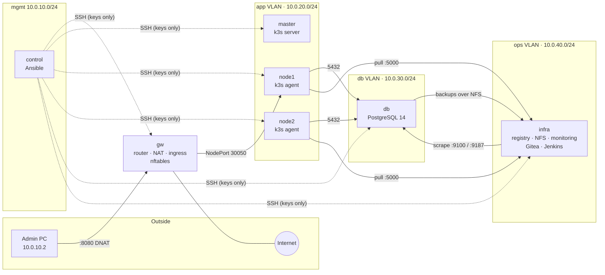

# Era 3 — Full Rebuild with Ansible

Era 1 built this platform by hand. Era 2 documented it.
**Era 3 rebuilds the entire infrastructure from scratch with Ansible**, from a dedicated control VM, on clean Ubuntu VMs.
Every component below is an Ansible role; nothing on the target hosts was configured manually.

---

## Architecture



| Host | Role | Network |
|---|---|---|
| `gw` | Router between VLANs, NAT to the internet, DNAT ingress | all VLANs + uplink |
| `master` | k3s server (control-plane, tainted NoSchedule) | app |
| `node1`, `node2` | k3s agents, run the application pods | app |
| `db` | PostgreSQL 14 on LVM, nightly backups | db |
| `infra` | Docker host: registry, Prometheus, Grafana, Alertmanager, Gitea; Jenkins (apt); NFS server | ops |
| `control` | Ansible control node (not managed by the playbook) | mgmt |

Every host also has a leg on the **mgmt** network (`10.0.10.0/24`) used for SSH/Ansible only.

---

## Repository layout

```
era3-ansible/
├── inventory/
│   ├── hosts.yaml
│   ├── group_vars/        # per-group config; secrets in vault.yaml (ansible-vault)
│   └── host_vars/         # per-host IPs / VLAN interfaces
└── logic/
    ├── ansible.cfg
    ├── playbooks/playbook.yaml   # one play per role, each with a tag
    └── roles/
```

## Roles

| Role | Hosts | What it does |
|---|---|---|
| `network` | all | Netplan VLAN interfaces (`enp0s9.<vlan>`), static `/etc/hosts`, hostname, disables cloud-init networking |
| `gateway` | gw | IP forwarding, nftables NAT (masquerade) and DNAT ingress `:8080 → node1:30050` |
| `common` | all | Baseline packages, timezone |
| `nfs_server` / `nfs_client` | infra / workers, db | NFS exports (`appdata`, `backups`) and `_netdev,nofail` mounts |
| `lvm` | db, infra | Data disk → VG → LV → XFS, mounted on `/var/lib/postgresql` and `/var/lib/docker` |
| `postgresql` | db | PostgreSQL 14, listens only on the db VLAN, `pg_hba` allows only the workers (scram-sha-256), app user/db |
| `k3s_server` / `k3s_agent` | master / workers | k3s install with token from vault, `--node-ip` / `--flannel-iface` pinned to the app VLAN |
| `docker` | infra | Docker with `overlay2` on the LVM volume, insecure local registry |
| `node_exporter` | all | Host metrics on `:9100` |
| `postgres_exporter` | db | DB metrics on `:9187` with a least-privilege `pg_monitor` user |
| `prometheus` / `grafana` / `alertmanager` | infra | Containers with provisioned datasource, alert rules (`InstanceDown`) and routing |
| `kubeconfig` | infra | kubectl + kubeconfig pulled from master (`slurp` + `delegate_to`) |
| `registry` | infra | `registry:2` on `:5000` |
| `k3s_registry` | k3s cluster | `registries.yaml` so containerd pulls from the HTTP registry |
| `gitea` | infra | Gitea (rootless image, built-in SSH on `:2222`, SQLite) |
| `jenkins` | infra | Jenkins from the official apt repo; `jenkins` user in `docker` group, own kubeconfig |
| `backup` | db | `pg_dump` → gzip → NFS, retention cleanup, systemd service + timer (02:00 daily) |
| `ssh_hardening` | all | Key-only SSH, no root login, fail2ban on `sshd` |
| `firewall` | db, infra | Host-based default-deny nftables; rules defined as data in `group_vars` |

## Running it

```bash
cd era3-ansible/logic
ansible-playbook playbooks/playbook.yaml --ask-vault-pass                  # everything
ansible-playbook playbooks/playbook.yaml --tags firewall --limit db --ask-vault-pass   # one role, one host
```

---

## Application path (end to end)

1. Code lives in Gitea (`flask-app` repo: `app.py`, `Dockerfile`, `k8s/`, `Jenkinsfile`).
2. Image is built and pushed to `infra:5000/flask-app:<tag>`.
3. k3s pulls it via `registries.yaml`; DB settings come from a ConfigMap, the password from a Secret.
4. Pods reach PostgreSQL on the db VLAN through `gw`; `pg_hba` and the db firewall only allow the two workers.
5. Users reach the app at `http://10.0.10.1:8080` → DNAT on `gw` → `node1:30050` (NodePort).

---

## Design decisions

- **One role per component.** Each piece can be run, tested and reasoned about on its own (`--tags`).
- **Secrets only in ansible-vault.** `group_vars/<group>/vault.yaml` holds `vault_*` values; normal vars reference them.
  The k8s Secret is created from the vault value, never committed.
- **Jenkins via apt, not as a container.** Docker and kubectl already exist on `infra`; installing Jenkins natively
  avoids docker-in-docker, socket mounts and permission workarounds.
- **Host-based firewall instead of one big rule set on the gateway.** Each host filters its own inbound traffic.
  Rules are data in `group_vars` (`port / proto / src / comment`) and one template renders them.
  It uses its own table (`inet hostfw`) and never `flush ruleset`, so it coexists with Docker's and k3s's rules.
- **Reuse a variable for two controls.** The PostgreSQL port rule uses `pg_hba_clients`, the same list that feeds
  `pg_hba.conf`, so adding a worker updates both from one place.
- **Ingress from the mgmt network.** VirtualBox NAT port-forwarding was unreliable; ingress is DNAT on the gateway's mgmt leg,
  with `ct status dnat masquerade` to avoid asymmetric routing (the target node also has a mgmt leg).
- **Database schema belongs to the application, not to infrastructure.** Ansible creates the database, user and access rules;
  tables are the application's responsibility.
- **Backups leave the database host.** Dumps go to NFS on `infra`, and the script refuses to run if the share is not mounted
  (the mount is `nofail`, so an empty local directory would otherwise silently receive the backup).

---

## Verification

Every role was checked with a positive **and** a negative test:

| Area | Test |
|---|---|
| NAT / routing | Internet access from every VLAN through `gw` only |
| PostgreSQL | Worker connects; any other host gets `no pg_hba.conf entry` |
| k3s | 3 nodes `Ready` on app-VLAN IPs |
| Registry | Pod with `infra:5000/busybox` scheduled on a worker reaches `Running` |
| Monitoring | 7/7 targets UP; stopping node_exporter on `node2` fires `InstanceDown` end-to-end |
| App | `curl http://node1:30050/` → `{"users": 2}`; same through the ingress from the admin PC |
| Backup | systemd run writes `appdb-<timestamp>.sql.gz` to NFS |
| SSH | Key login works; `ssh -o PubkeyAuthentication=no` → `Permission denied (publickey)` |
| fail2ban | 5 failed logins from `gw` → banned on `db`; manual unban |
| Firewall | App, SSH and Prometheus still work; `nc` from `gw` to `db:5432` / `infra:3000` times out |

---

## Debugging notes

Real problems hit during the rebuild, and what fixed them.

| Symptom | Cause | Fix |
|---|---|---|
| Netplan: `interface 'enp0s9' is not defined` | VLAN parent not declared in the same config | Declare `enp0s9` under `ethernets` |
| Prometheus rules silently empty; `alert_rules.yml` became a directory | Container started before the file existed — Docker bind-mounts a missing path as a directory | Render templates **before** starting the container; absolute path in `rule_files` |
| Images filling the root disk despite `/var/lib/docker` on LVM | Docker's containerd image store writes to `/var/lib/containerd` | `"containerd-snapshotter": false` in `daemon.json` → `overlay2` on LVM |
| `k3s_registry` failed on agents | `/etc/rancher/k3s` is created only by the server | Create the directory before writing `registries.yaml` |
| Pods `ErrImageNeverPull` | Old manifest still had `imagePullPolicy: Never` | `IfNotPresent` + full registry path in `image:` |
| Jenkins apt: `NO_PUBKEY 7198F4B714ABFC68` | Jenkins rotated its repository signing key; the old one had expired | New key URL (`jenkins.io-2026.key`) + `force: true` so it is re-downloaded |
| `pg-backup.service` exit `203/EXEC` | Script deployed without the execute bit | `mode: '0755'` on the template task |
| Ingress via VirtualBox port-forward: connection refused | Traffic never reached the gateway (`tcpdump` empty) | Moved ingress to the gateway's mgmt leg + `ct status dnat masquerade` |
| SSH hardening drop-in ignored | sshd keeps the **first** value; `50-cloud-init.conf` sorts before `99-*` | Name the file `01-hardening.conf`; verify with `sshd -T` |
| Facts lookup failed for `enp0s9_20` | Fact keys keep the dot: `ansible_facts['enp0s9.20']` | Index facts with the variable `ansible_facts[k3s_iface]` |

